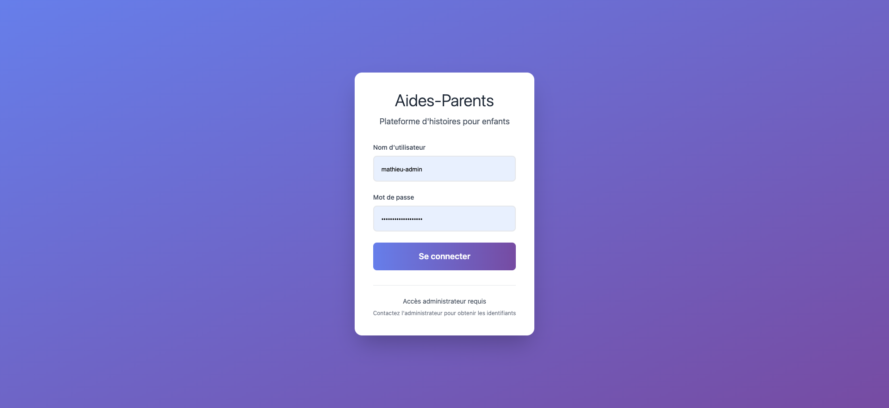

# Aides-Parents - UI Documentation

**Date:** March 10, 2026  
**Version:** Current Production  
**Reviewed by:** Angela (UI/UX PM)

---

## Table of Contents

1. [Design System](#design-system)
2. [Screen Inventory](#screen-inventory)
3. [Component Library](#component-library)
4. [User Flows](#user-flows)
5. [Accessibility](#accessibility)
6. [Issues & Recommendations](#issues--recommendations)

---

## Design System

### Color Palette

#### Current Colors (Limited)
```css
primary: {
  50: #f0f4ff
  100: #e0e7ff
  500: #667eea  /* Main purple */
  600: #5a67d8
  700: #4c51bf
}

secondary: {
  500: #764ba2  /* Accent purple */
  600: #6b46c1
}
```

#### Recommended Expansion
```css
primary: {
  50: #f0f4ff   /* Very light purple */
  100: #e0e7ff  /* Light purple */
  200: #c7d2fe  /* Soft purple */
  300: #a5b4fc  /* Medium light */
  400: #818cf8  /* Medium */
  500: #667eea  /* Brand primary */
  600: #5a67d8  /* Hover state */
  700: #4c51bf  /* Active state */
  800: #434190  /* Dark */
  900: #3c366b  /* Very dark */
}

secondary: {
  50: #faf5ff
  100: #f3e8ff
  200: #e9d5ff
  300: #d8b4fe
  400: #c084fc
  500: #764ba2  /* Brand secondary */
  600: #6b46c1
  700: #5b21b6
  800: #4c1d95
  900: #3b0764
}

gray: {
  /* Use Tailwind defaults */
  50-900
}

semantic: {
  success: #10b981
  warning: #f59e0b
  error: #ef4444
  info: #3b82f6
}
```

### Typography

**Current:** Tailwind defaults (no custom scale)

**Recommendation:**
```css
font-family: 
  sans: 'Inter', system-ui, -apple-system, sans-serif
  
font-size:
  xs: 12px
  sm: 14px
  base: 16px
  lg: 18px
  xl: 20px
  2xl: 24px
  3xl: 30px
  4xl: 36px
  
font-weight:
  light: 300
  normal: 400
  medium: 500
  semibold: 600
  bold: 700
```

### Spacing Scale

Using Tailwind's default 4px base scale:
- `1` = 4px
- `2` = 8px
- `3` = 12px
- `4` = 16px
- `6` = 24px
- `8` = 32px
- `10` = 40px

### Border Radius

```css
rounded-lg: 8px    /* Standard cards/buttons */
rounded-2xl: 16px  /* Large containers */
rounded-full: 9999px  /* Pills/avatars */
```

### Shadows

```css
shadow-sm: Subtle elevation
shadow-lg: Cards and modals
shadow-xl: Hover states
shadow-2xl: Login card
```

### Gradients

**Primary Gradient** (overused):
```css
bg-gradient-to-br from-primary-500 to-secondary-500
/* Purple to violet gradient */
```

**Recommendation:** Use sparingly for CTAs and key UI elements only.

---

## Screen Inventory

### 1. Login Page



**Layout:**
- Centered card on gradient background
- Full viewport height with flexbox centering
- White card with shadow-2xl

**Elements:**
- H1: "Aides-Parents" (text-4xl, font-light)
- Tagline: "Plateforme d'histoires pour enfants"
- Username input (with prefilled value - SECURITY ISSUE)
- Password input (with prefilled value - SECURITY ISSUE)
- Primary button: "Se connecter" (gradient background)
- Footer text: Admin access notice

**Issues:**
- ❌ Credentials exposed in DOM
- ❌ No "forgot password" flow
- ❌ No loading state on button during login
- ✅ Good accessibility (ARIA labels)
- ✅ Proper form semantics

---

### 2. Dashboard

**Layout:** (Based on DashboardUI.js)
- Header navigation (sticky)
- Grid of action cards (1 col mobile, 2 col tablet, 3 col desktop)

**Cards:**
1. **Nouvelle histoire (Quick)** - PRIMARY (gradient background)
   - Icon: fas fa-wand-magic-sparkles
   - Description: "Créez une histoire en quelques étapes rapides"
   
2. **Créer une histoire (Legacy)** - DEPRECATED (hidden by default)
   - Icon: fas fa-book
   - Flag: `ENABLE_LEGACY_STORY_CREATOR`
   
3. **Mes histoires**
   - Icon: fas fa-book-open
   - Description: "Consultez et gérez vos histoires créées"
   
4. **Gestion utilisateurs**
   - Icon: fas fa-users
   - Description: "Créez et gérez les comptes utilisateurs"
   
5. **Statistiques**
   - Icon: fas fa-chart-bar
   - Description: "Visualisez les statistiques d'utilisation"
   
6. **Personnages**
   - Icon: fas fa-user
   - Description: "Créez et gérez vos personnages réutilisables"

**Issues:**
- ❌ No welcome message or user context
- ❌ No quick stats/overview
- ❌ Cards are clickable divs with onclick (bad for accessibility)
- ✅ Clear visual hierarchy
- ✅ Good use of icons

---

### 3. Quick Story Creation

**Layout:** (Based on QuickStoryUI.js)
- White container with rounded corners
- Header with title + link to "Création complète"
- Form with vertical spacing

**Form Fields:**
1. **Difficulté** (dropdown)
   - Options: Facile, Moyen, Plus difficile
   - Default: Moyen
   
2. **Longueur** (dropdown)
   - Options: Courte (2-3 paragraphes), Moyenne (4-5), Longue (6-7)
   - Default: Moyenne
   
3. **Idée** (text input)
   - Placeholder: "Ex: un petit dragon qui aime lire..."
   - Required field

**Actions:**
- Primary button: "Générer l'histoire" (with magic wand icon)
- Secondary button: "Annuler"

**States:**
- Loading: Blue spinner with "Génération en cours…"
- Success: Green alert with link to open story
- Error: Red alert with error message

**Issues:**
- ✅ Simple, focused UX
- ✅ Clear loading states
- ❌ No character/theme selector
- ❌ No preview of what will be generated

---

### 4. Story List

**Layout:** (Based on StoryListUI.js - 21KB component)

**Features:**
- Search/filter bar
- Grid of story cards
- Each card shows:
  - Title
  - Preview text
  - Metadata (date, grade level)
  - Action buttons (Edit, Delete, View)

**Issues:**
- ❌ No empty state for "no stories yet"
- ❌ No bulk actions
- ❌ No sorting options visible
- ❌ Delete has no confirmation modal

---

### 5. Story Editor

**Layout:** (Based on StoryEditorUI.js - 65KB MONOLITH)

**Sections:**
- Story metadata editor
- Rich text editor for content
- Quiz question builder
- Image upload/library
- Preview pane

**Issues:**
- 🔥 MASSIVE component (65KB) - needs splitting
- ❌ No autosave indicator
- ❌ No version history
- ❌ Complex UX, steep learning curve

---

### 6. User Management

**Layout:** (Based on UserManagementUI.js - 19KB)

**Features:**
- Table of users
- Add user button
- Edit/Delete actions per row

**Issues:**
- ❌ No empty state
- ❌ No confirmation before delete
- ❌ No role/permission management shown
- ❌ No bulk invite/delete

---

### 7. Statistics

**Layout:** (Based on StatisticsUI.js - 2.8KB)

**Widgets:**
- Total stories created
- Active users
- Stories by grade level (chart)
- Recent activity timeline

**Issues:**
- ⚠️ Very small component - likely bare-bones
- ❌ No date range selector
- ❌ No export functionality

---

### 8. Character Manager

**Layout:** (Based on CharacterManagerUI.js - 24KB)

**Features:**
- Gallery of saved characters
- Create new character
- Edit character attributes
- Reuse in stories

**Issues:**
- ❌ 24KB component suggests complexity
- ❌ Unknown if has image upload
- ❌ Unknown if supports character relationships

---

### 9. Template Manager

**Layout:** (Based on TemplateManagerUI.js - 23KB)

**Features:**
- Predefined story templates
- Create custom templates
- Template preview

**Issues:**
- ❌ Medium-sized component, unclear complexity
- ❌ Unknown if templates are shareable

---

### 10. Image Library

**Layout:** (Based on ImageLibraryUI.js - 12KB)

**Features:**
- Grid of uploaded images
- Upload new images
- Search/filter
- Insert into stories

**Issues:**
- ❌ Unknown if has tags/categories
- ❌ Unknown file size limits
- ❌ Unknown supported formats

---

## Component Library

### Current Components (Template Strings)

All components are built via string concatenation. No reusable component library exists.

#### Recommended Component Extraction

**1. Card Component**
```javascript
class Card {
    static render({ 
        icon,           // Font Awesome class
        title,          // Card title
        description,    // Card subtitle
        onClick,        // Click handler
        primary = false // Gradient style?
    }) {
        const baseClasses = 'rounded-2xl shadow-lg hover:shadow-xl p-8 text-center cursor-pointer transform hover:-translate-y-1 transition-all duration-200';
        const colorClasses = primary 
            ? 'bg-gradient-to-r from-primary-500 to-secondary-500 text-white border border-transparent'
            : 'bg-white border border-gray-100 text-gray-900';
        
        return `
            <div 
                onclick="${onClick}" 
                onkeydown="if(event.key==='Enter'){${onClick}}" 
                tabindex="0" 
                role="link"
                class="${baseClasses} ${colorClasses} focus:outline-none focus:ring-2 focus:ring-primary-500 focus:ring-offset-2">
                <div class="text-4xl mb-4 ${primary ? 'text-white' : 'text-primary-500'}">
                    <i class="${icon}" aria-hidden="true"></i>
                </div>
                <h3 class="text-xl font-semibold mb-3">${HTMLUtils.escape(title)}</h3>
                <p class="${primary ? 'text-primary-100' : 'text-gray-600'} leading-relaxed">
                    ${HTMLUtils.escape(description)}
                </p>
            </div>
        `;
    }
}
```

**2. Button Component**
```javascript
class Button {
    static render({
        text,
        icon = null,
        variant = 'primary', // primary, secondary, danger
        type = 'button',
        onClick = null,
        disabled = false
    }) {
        const variants = {
            primary: 'bg-gradient-to-r from-primary-500 to-secondary-500 text-white hover:shadow-lg',
            secondary: 'bg-gray-200 text-gray-700 hover:bg-gray-300',
            danger: 'bg-red-500 text-white hover:bg-red-600'
        };
        
        return `
            <button 
                type="${type}"
                ${onClick ? `onclick="${onClick}"` : ''}
                ${disabled ? 'disabled' : ''}
                class="px-6 py-3 rounded-lg font-medium transition-all duration-200 focus:outline-none focus:ring-2 focus:ring-primary-500 focus:ring-offset-2 ${variants[variant]} ${disabled ? 'opacity-50 cursor-not-allowed' : ''}">
                ${icon ? `<i class="${icon} mr-2" aria-hidden="true"></i>` : ''}
                ${HTMLUtils.escape(text)}
            </button>
        `;
    }
}
```

**3. FormField Component**
```javascript
class FormField {
    static render({
        id,
        label,
        type = 'text',
        value = '',
        placeholder = '',
        required = false,
        hint = null
    }) {
        return `
            <div class="text-left">
                <label for="${id}" class="block text-sm font-medium text-gray-700 mb-2">
                    ${HTMLUtils.escape(label)}${required ? ' <span class="text-red-500">*</span>' : ''}
                </label>
                <input 
                    type="${type}" 
                    id="${id}" 
                    name="${id}" 
                    ${required ? 'required aria-required="true"' : ''}
                    ${hint ? `aria-describedby="${id}-hint"` : ''}
                    ${placeholder ? `placeholder="${HTMLUtils.escape(placeholder)}"` : ''}
                    value="${HTMLUtils.escape(value)}"
                    class="w-full px-4 py-3 border-2 border-gray-200 rounded-lg text-lg focus:outline-none focus:border-primary-500 focus:ring-2 focus:ring-primary-500 transition-colors">
                ${hint ? `<span id="${id}-hint" class="text-sm text-gray-500 mt-1 block">${HTMLUtils.escape(hint)}</span>` : ''}
            </div>
        `;
    }
}
```

**4. Alert Component**
```javascript
class Alert {
    static render({
        type = 'info', // success, error, warning, info
        title,
        message,
        dismissible = false
    }) {
        const styles = {
            success: 'bg-green-50 border-green-200 text-green-800',
            error: 'bg-red-50 border-red-200 text-red-800',
            warning: 'bg-yellow-50 border-yellow-200 text-yellow-800',
            info: 'bg-blue-50 border-blue-200 text-blue-800'
        };
        
        const icons = {
            success: 'fas fa-check-circle text-green-500',
            error: 'fas fa-exclamation-triangle text-red-500',
            warning: 'fas fa-exclamation-circle text-yellow-500',
            info: 'fas fa-info-circle text-blue-500'
        };
        
        return `
            <div class="p-4 border rounded-lg ${styles[type]}" role="alert">
                <div class="flex items-start gap-3">
                    <i class="${icons[type]} mt-1" aria-hidden="true"></i>
                    <div class="flex-1">
                        ${title ? `<h4 class="font-semibold mb-1">${HTMLUtils.escape(title)}</h4>` : ''}
                        <p class="text-sm">${HTMLUtils.escape(message)}</p>
                    </div>
                    ${dismissible ? '<button onclick="this.parentElement.parentElement.remove()" class="text-gray-400 hover:text-gray-600"><i class="fas fa-times"></i></button>' : ''}
                </div>
            </div>
        `;
    }
}
```

**5. Modal Component** (MISSING)
```javascript
class Modal {
    static render({
        id,
        title,
        content,
        actions = []
    }) {
        return `
            <div id="${id}" class="fixed inset-0 bg-black bg-opacity-50 flex items-center justify-center z-50 hidden" role="dialog" aria-labelledby="${id}-title" aria-modal="true">
                <div class="bg-white rounded-2xl shadow-2xl max-w-lg w-full mx-4 p-6">
                    <div class="flex justify-between items-start mb-4">
                        <h2 id="${id}-title" class="text-2xl font-semibold text-gray-900">${HTMLUtils.escape(title)}</h2>
                        <button onclick="document.getElementById('${id}').classList.add('hidden')" class="text-gray-400 hover:text-gray-600">
                            <i class="fas fa-times"></i>
                        </button>
                    </div>
                    <div class="mb-6">
                        ${content}
                    </div>
                    <div class="flex gap-3 justify-end">
                        ${actions.map(action => Button.render(action)).join('')}
                    </div>
                </div>
            </div>
        `;
    }
}
```

**6. EmptyState Component** (MISSING)
```javascript
class EmptyState {
    static render({
        icon,
        title,
        message,
        action = null
    }) {
        return `
            <div class="text-center py-12">
                <div class="text-6xl text-gray-300 mb-4">
                    <i class="${icon}" aria-hidden="true"></i>
                </div>
                <h3 class="text-xl font-semibold text-gray-700 mb-2">${HTMLUtils.escape(title)}</h3>
                <p class="text-gray-500 mb-6 max-w-md mx-auto">${HTMLUtils.escape(message)}</p>
                ${action ? Button.render(action) : ''}
            </div>
        `;
    }
}
```

---

## User Flows

### Primary Flow: Quick Story Creation

```
1. Login
   ↓
2. Dashboard
   ↓
3. Click "Nouvelle histoire (flux simplifié)"
   ↓
4. Select:
   - Difficulty (dropdown)
   - Length (dropdown)
   - Idea (text input)
   ↓
5. Click "Générer l'histoire"
   ↓
6. Loading spinner (2-30s depending on API)
   ↓
7. Success alert with "Ouvrir l'histoire" link
   ↓
8. View generated story in new tab
```

**Pain Points:**
- No preview before generation
- No way to cancel during generation
- No indication of queue position if API is slow
- Success screen doesn't show story preview inline

---

### Secondary Flow: Story Management

```
1. Dashboard → "Mes histoires"
   ↓
2. Browse story cards
   ↓
3. Click "Edit" on a story
   ↓
4. Story Editor (complex UI)
   ↓
5. Make changes
   ↓
6. Save (unclear if autosave exists)
   ↓
7. Back to story list
```

**Pain Points:**
- No breadcrumb trail to show where you are
- No autosave indicator
- No version history
- No "unsaved changes" warning

---

## Accessibility

### Strengths ✅

1. **Semantic HTML**
   - Proper use of `<nav>`, `<main>`, `<header>`, `<form>`
   - Heading hierarchy maintained

2. **ARIA Labels**
   - Forms have `aria-label`
   - Inputs have `aria-describedby`
   - Current page marked with `aria-current="page"`
   - Alerts use `role="alert"` and `aria-live="polite"`

3. **Keyboard Navigation**
   - Interactive cards have `tabindex="0"`
   - `onkeydown` handlers for Enter key
   - Focus states defined (`:focus:ring-2`)

4. **Screen Reader Support**
   - `.sr-only` class for hidden labels
   - Icon decorations marked `aria-hidden="true"`

### Issues ❌

1. **No Skip Links**
   - Missing "Skip to main content" link for keyboard users

2. **Color Contrast**
   - Primary-500 (#667eea) on white needs verification for WCAG AA
   - Gray text on gradient backgrounds may fail contrast

3. **Focus Management**
   - Full page re-renders lose focus position
   - No focus trap in modals (if they existed)

4. **Inconsistent Patterns**
   - Some buttons are actual `<button>` elements
   - Some are `<div onclick>` (bad for screen readers)

---

## Issues & Recommendations

### 🔴 Critical Issues

1. **Credentials in DOM**
   - Login page has prefilled username/password in HTML
   - **Fix:** Remove immediately. Use dev tools or query param for testing.

2. **Monolithic Components**
   - `StoryEditorUI.js` = 65KB
   - `StoryCreationUI.js` = 47KB
   - **Fix:** Split into smaller, focused components.

3. **No Component Library**
   - Copy-paste markup everywhere
   - **Fix:** Extract Card, Button, FormField, Modal, EmptyState components.

---

### 🟡 High Priority

4. **State Management**
   - Full page re-renders (`document.body.innerHTML = ...`)
   - **Fix:** Update only content area, or migrate to framework.

5. **No Empty States**
   - Story list, user list show nothing when empty
   - **Fix:** Add EmptyState component with helpful CTA.

6. **No Confirmation Dialogs**
   - Delete actions have no confirmation
   - **Fix:** Add Modal component for confirmations.

7. **Mobile Navigation**
   - 6 nav buttons will overflow on mobile
   - **Fix:** Hamburger menu for screens < 768px.

---

### 🟢 Medium Priority

8. **Limited Design Tokens**
   - Only 2 color shades defined
   - **Fix:** Expand to full 50-900 spectrum.

9. **Gradient Overuse**
   - Purple gradient on background, buttons, cards
   - **Fix:** Reserve for primary CTAs only.

10. **No Breadcrumbs**
    - Users can't see navigation path
    - **Fix:** Add breadcrumb trail to NavigationUI.

11. **Font Awesome CDN**
    - External dependency, tracking concerns
    - **Fix:** Self-host or switch to SVG icons.

12. **No Skip Links**
    - Keyboard users can't skip navigation
    - **Fix:** Add skip link to header.

---

### 🔵 Low Priority (Strategic)

13. **Framework Migration**
    - String templates are hard to maintain
    - **Consider:** Preact, Alpine.js, or htmx for better DX.

14. **Design System**
    - No Storybook or component documentation
    - **Consider:** Build proper design system.

15. **Component Testing**
    - No tests for UI components
    - **Consider:** Add Playwright or Vitest tests.

---

## Next Steps

### Immediate (This Week)
- [ ] Remove credential leak from login page
- [ ] Extract Card component
- [ ] Extract Button component
- [ ] Add EmptyState to StoryListUI

### Short-term (This Month)
- [ ] Expand color palette in Tailwind config
- [ ] Add Modal component
- [ ] Implement confirmation dialogs
- [ ] Add mobile hamburger menu
- [ ] Split StoryEditorUI into smaller components

### Long-term (This Quarter)
- [ ] Build reusable component library
- [ ] Add breadcrumb navigation
- [ ] Self-host Font Awesome or migrate to SVG
- [ ] Implement autosave in Story Editor
- [ ] Add comprehensive empty states across all views
- [ ] Evaluate framework migration (Preact/Alpine)

---

**Documentation by:** Angela Lopez (UI/UX PM)  
**Last Updated:** March 10, 2026
